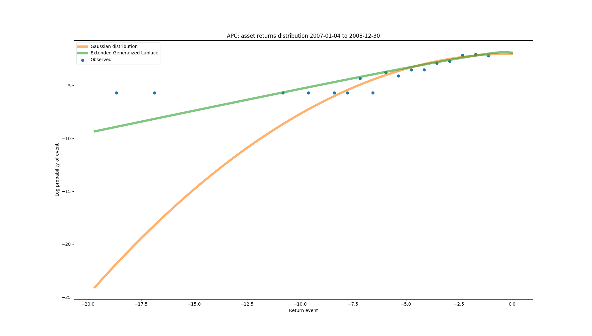
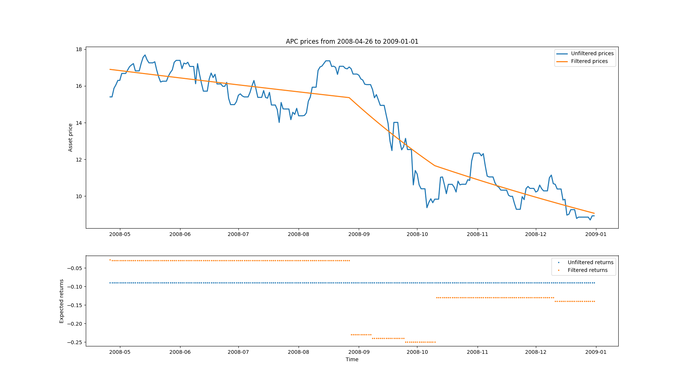
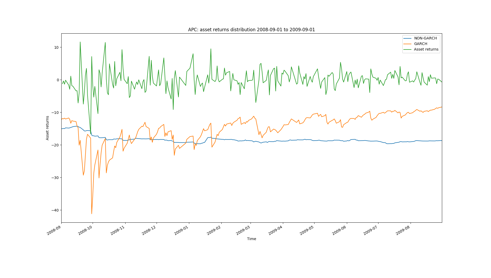
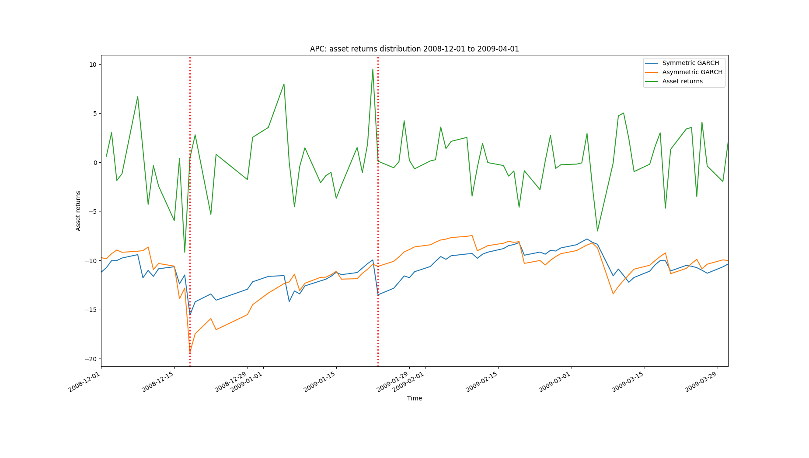

## Model features <a name="features"/>

The following section highlights some of the particular characteristics of our model using the stock of the Anadarko Petroleum Corporation (APC) during the financial crisis 2008/09 as an example.

### Heavy-tails <a name="hevtai"/>

As mentioned in the introductory section, unlike the widely used Gaussian-based models, the MGL distribution has heavy tails and can accommodate extreme market events. This situation can be seen in the following figure, depicting the left tail of both distributions fit the daily returns during the most severe months of the crisis.

From the graph, one can easily see that the MGL distribution provide a much better fit to the observed daily left-tail returns than the Gaussian distribution: The MGL assigns a ~0.01 percentage probability to a 20% daily drop in market value (i.e. happens approximately once every 40 years), whereas the Gaussian distributions assign just a ~0.000000001% probability (which basically translates to "can never happen") and thus gravely underestimates the risk of this stock.

### Dynamic returns <a name="dynret"/>

To model the occurrence of alternate market regimes, the GARCH-related part of the engine incorporates a least-squares filter with L1-penalization to estimate expected asset returns. This approach translates into stepwise linear, dynamic mean estimates which depend on the current market regime as can be seen in the lower subfigures:

While the traditional mean estimates of the fitted MGL distribution (blue, lower figure) stay constant over the depicted period, the mean estimates from the L1-filtered returns (orange, lower figure) are dynamic and reflect changes in market regimes.

### Dynamic volatility <a name="dynvol"/>

To accommodate for the occurrence of volatility clustering (i.e. significant changes tend to be followed by substantial changes, of either sign, and small changes tend to be followed by small changes) and changing volatility regimes, asset volatilities are modelled as a GARCH-type process. The results can be seen in the figure below that shows the Value-at-Risk (which is a function of the asset risk/volatility) for both GARCH and non-GARCH type models. While the market slowly recovers from the big drop near the left edge and the asset returns become less frantic, the non-GARCH type model reacts very slowly if at all, whereas the GARCH-type model accurately reflects these changes in market risk:

Note that this not only leads to more accurate volatility forecasts in terms of better violation ratios but at the same time translates into higher Value-at-Risk (VaR) values during calm markets. This increase is of great importance for financial applications that rely on accurate measures of not only excess but also moderate risks (e.g. in option or Lombard credit pricing).

### Asymmetric volatility <A name="asyvol"/>

Besides its clustering behaviour, volatility is asymmetric and reacts differently to positive and negative shocks. Notably, there are often much stronger volatility reactions to negative than to positive market shocks. Intuitively, this makes sense, and there is much more uncertainty after, e.g. a stock drops 5% due to bad news than a stock jumping 5% due to good news.

The value of an asymmetric GARCH-type model can be observed from the following figure, where we see that the volatility resulting from symmetric versus asymmetric GARCH-type models acts slightly differently following a negative shock (left marker line) and very differently following a positive shock (right marker line):

This model not only results in more accurate volatility forecasts but also leads to smoother risk-measures and removes risk-related false-positives. Note that the peculiarities of the reactions depend on the characteristics of the particular asset (APC in this case) and the reaction can be the same - if warranted by the data.
